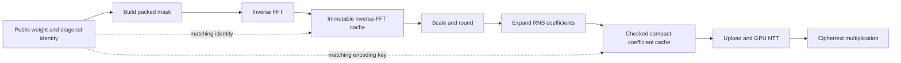

# Public-weight preparation: cache admission and execution boundaries

The next preparation optimization needs a deliberate admission policy.
The actual Mamba-3 program visits **4,488 weight/diagonal identities in exactly
the same order five times**. A cache that admits every miss and evicts the
least recently used entry gets **zero hits below 4,488 entries**, even with
2 GiB of inverse-FFT storage. Keeping a fixed subset instead allows useful
reuse within a smaller memory budget.

This is source analysis and a static trace calculation performed while the
ownership campaign runs. No measured inference source, dependency or GPU
configuration was changed. These counts are not a measured cache speedup.

[Trace, analyzer, policy calculation and source identities](../../results/cpu/2026-09-25/preparation-design/).

The subsequent [compact-coefficient experiment](2026-09-25-weight-coefficient-cache.md)
checks the final-coefficient alternative on hardware. It passes exact RNS
checks but regresses 1.26% on the cold three-step model probe: level variants
produce 825 entries for only 297 hits. That prototype is rejected. The
inverse-FFT alternative described here remains unimplemented.

## What repeats, and how much storage it needs

The analyzer reads the same frozen full program, uses the existing liveness
planner and replicated-linear geometry, and follows all 240 live linear calls
in evaluation order. It expands them into 22,440 diagonal accesses. All 4,488
identities occur five times, with 4,487 distinct identities between uses.
Rows, columns and the derived geometry match on every use of each weight.

An inverse-FFT vector contains 32,768 complex doubles, or 512 KiB. It precedes
CKKS scaling and rounding, so a cache of this intermediate can share across
levels and scales while holding the model, packing and FFT convention fixed.

| Numeric payload capacity | Entries | LRU hits | Fixed-subset hits | Fraction of weight preparations reused |
| --- | ---: | ---: | ---: | ---: |
| 32 MiB | 64 | 0 | 256 | 1.14% |
| 512 MiB | 1,024 | 0 | 4,096 | 18.25% |
| 1 GiB | 2,048 | 0 | 8,192 | 36.51% |
| 2 GiB | 4,096 | 0 | 16,384 | 73.01% |
| 2.19140625 GiB | 4,488 | 17,952 | 17,952 | 80.00% |

The fixed subset is a simple admission policy: fill selected identities on
their first use and retain them for the request. It is not a claim of globally
optimal scheduling. The model is not reordered. Metadata, temporary copies
and allocator overhead are additional to the table's numeric payload.

The existing 64-entry mask cache deliberately rejects dense weights. Expanding
its admission rule would both fail to retain this cyclic working set and put
already useful mask entries under eviction pressure. Keep these policies
separate and use an explicit immutable weight identity instead of hashing an
entire newly generated dense mask on every lookup.

Mamba-2 already uses fixed admission, so the LRU finding must not be attributed
to its cache. Its [current full-run counters](../../results/dgx/2026-09-24/owned-arithmetic/m2-full-candidate/native.json)
show 356 entries filling a nominal 5-GiB RNS budget, but only five replicated
weight hits against 22,435 misses. The selector sorts by reuse count and then
registration order; equal-frequency weight entries follow the earlier masks
and per-layer vectors. Its score does not include entry size or measured
preparation/level-adjustment cost. Reconsidering saved time per resident byte
is a concrete additional candidate after GPU NTT changed those costs. Count
CPU and uploaded GPU residency too; the nominal budget estimates one RNS copy.
Do not assume that simply replacing the existing selector with LRU helps.

## Two cache boundaries with different integration costs

The diagram shows potential reuse boundaries in the existing pipeline, not
an implemented pair of caches. The current shared preparation bridge calls
OpenFHE's full encoder and then uploads the result.

**Inverse-FFT reuse** avoids rebuilding and transforming repeated masks. It
requires an encoder entry point after the existing inverse FFT. A hit must
copy the cached complex vector into mutable scratch before scaling it; the
stored vector remains immutable. Retain the pinned FFT, scaling, rounding,
overflow and exception behavior. A raw new encoder implementation is not
needed to test this boundary, but OpenFHE integration is required.

**Compact final coefficients** can start from an ordinary completed encode.
Recover a signed representative from one modulus, then verify that it
reproduces every coefficient in every RNS limb exactly. Admit the entry only
when this roundtrip and the supported range hold. This makes the existing
encoder the authority for rounding. Unsupported cases retain the current
path. Degree-one public multipliers are the first target; additive plaintexts
and degree correction should remain outside the initial cache.

One signed 64-bit word per polynomial coefficient also costs 512 KiB, versus
12 MiB of RNS payload at illustrative level 21: a 24-fold representation
difference. Unlike inverse-FFT entries, final coefficients additionally need
the exact context/moduli, level, scale bits and noise degree in their key.
The trace does not observe those variants, so it does not prove that 2.19 GiB
covers a final-coefficient cache. The public-mask range inventory is suggestive,
but is not a bound on floating FFT error or a replacement for the roundtrip.

CPU expansion on a hit is the smaller integration step. A later GPU expansion
could upload one compact polynomial and expand it into the existing NTT
buffers, reducing transfer volume too. That path needs exact pre- and post-NTT
checks and a supported plaintext representation: the current FIDESlib
`PlaintextImpl::GetLevel()` reads CPU metadata and returns zero when it is
absent. Dropping CPU storage silently would break the contract. CPU fallback,
readback, level adjustment and metadata must remain valid or explicitly
materialize the compact representation before use.

## CPU preparation can overlap; GPU API calls need one owner

The pinned device registries have their lock calls commented out. Existing
preparation statistics are mutable counters as well. Calling the shared
`encode()`/`load()` object concurrently is therefore not an established safe
worker design.

A bounded producer queue should run only CPU mask/FFT preparation, using
worker-local scratch and initialized immutable FFT/context tables. The
evaluation thread retains GPU registration, upload, NTT and arithmetic.
Keep the CPU buffers until their upload completes, bound queued bytes, and
include queue wait and preparation time in the request's total timing.
Preparing weights before the evaluation timer alone is not a speedup result.
Report cold-request and reused-model costs separately.

The first inverse-FFT identity is known from the static model. Final coefficient
preparation also needs the actual level/scale contract; do not guess those
values from the weight identity. A cold miss can retain the existing path.

## Synchronization: retaining scratch is necessary but insufficient

The pinned `Ciphertext` destructor calls `cudaDeviceSynchronize()` before
returning polynomial storage to the pool. Its lifetime patch explains why:
another object's output stream may still read the input. Waiting only for
the input's streams is insufficient. Removing wrapper synchronizations while
immediately releasing temporary operands leaves this global barrier in place.

A useful first scope is one inner BSGS accumulation, with a small byte-bounded
set of retired right operands and uploaded plaintexts. Retire a consumed input
after the ownership check and arithmetic dispatch; retaining an alias before
that check would force the new helper to clone it again. Complete all relevant
consumer work before releasing the retained storage, including on exceptions.
Backend-created temporaries also need inspection: `multPt` can create a local
adjusted plaintext, which is not covered merely by retaining the caller's
handles until the end of a block.

This can reduce host round trips while keeping the destructor guard. Removing
that guard itself needs producer/consumer events and pool reuse governed by
the last reader, across every participating stream. It is a larger backend
change. Mamba-2's current `CUDA_LAUNCH_BLOCKING=1` also prevents general launch
overlap; changing that setting needs its own correctness and timing controls.
Mamba-3 is the smaller first asynchronous scope to investigate.

## Performance headroom and the next falsifiable checks

The completed ownership candidate measures 949.257737 seconds, including
169.527331 seconds recorded in host encoding, 23.244351 in upload and
515.042541 in refresh. These timers are not an additive partition. The 17,952
potential repeat hits are 35.26% of all 50,913 host encode calls, and inverse-FFT
reuse removes only part of an encode. Neither an 80% weight hit rate nor a
24-fold storage difference implies that much model speedup.

The node profile gives a tighter scope for this candidate: first-use linear
nodes record 26.543792 seconds outside refresh; repeated `linear_ref` nodes
record 104.680594 seconds outside refresh. The latter includes all their
rotations, arithmetic, preparation and synchronization. A repeat-weight cache
addresses only a subset of those 104.68 seconds, not the entire 169.53-second
host-encoding total. These category times are observations, not an achieved
latency reduction or a prediction for a new cache.

Refresh remains the largest recorded category. The current grouping has a
16-node cap but reaches only eight; increasing the cap alone does not address
the observed run. Its 726 physical bootstrap calls form 363 two-pass refresh
events: 260 grouped events and 103 single-value events. The groups contain
1,005 values in total, averaging 3.87 values per group. The remaining singleton
events are not necessarily jointly schedulable. Source inspection shows that
eligibility also depends on
live values, next consumers, level and slot capacity. A scheduler change needs
a trace of actual levels, group occupancy and rejected candidates before a
refresh-count reduction can be claimed. The conservative symbolic planner
alone is not that trace.

The evaluator currently follows the serialized node order. A further scheduling
candidate is to advance independent ready branches to compatible refresh points
before processing a whole branch in isolation. Any such experiment must preserve
client-feedback ordering, rebuild liveness/last-use information for the new
schedule and validate its level model against real traces. Static DAG readiness
does not prove that values can safely share a refresh.

The next preparation experiment should first measure inverse FFT versus
rounding/RNS expansion on representative public diagonals, recording actual
level/scale keys. Then compare a bounded fixed-subset cache with the unchanged
encoder, using exact RNS/metadata equality, live-cache immutability, overflow
fallbacks and unchanged model gates. Prefix comparisons decide whether a full
pair is justified. Event-based retirement is a separate experiment so its
lifetime risks and effect can be assessed independently.

The separate [range-scan CPU prototype](2026-09-25-encoding-range.md) already
shows why this decomposition matters: a 3.51-fold isolated scan improvement
becomes only 2.31–3.92% in full plaintext construction on that local CPU.
No new DGX speed result is asserted by this design study.
