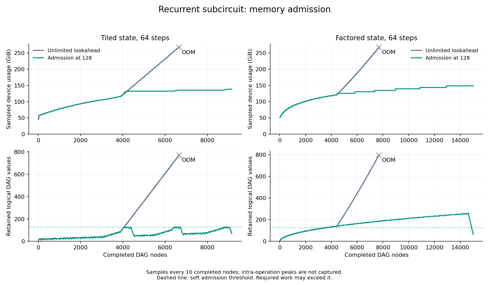

# Recurrent execution memory admission — 2026-09-27

Both 64-step recurrence representations now complete under the existing
classical-128 and 0.001 error gates. One shared scheduling change stops preparing
later independent branches when too many DAG values are retained, then finishes
the oldest ready branch using the existing refresh circuit.
The [preceding recurrence study](2026-09-27-recurrent-state.md) found that fixed
recurrent state alone did not prevent both 64-step representations from running
out of memory. The new measurements distinguish the eight carried state
ciphertexts from the executor's much larger working set.
The option is retained for memory-sensitive recurrence runs, with the existing
unlimited schedule still the default. A matched 40-step pair reduces sampled
peak memory 29.6% and evaluation time 4.27%; state arithmetic is nearly unchanged.

## Failure mechanism

Both unlimited-lookahead controls reproduce the previous CUDA allocation
failures at the same progress checkpoints. Neither produces a native result;
both exit zero despite the CUDA error. They remain unsuccessful runs and are
never used as complete speed baselines.

| 64-step control | Last completed nodes | Peak live DAG values | Last sampled device usage (GiB) | Cache entries | Bootstraps |
| --- | ---: | ---: | ---: | ---: | ---: |
| Fixed state | 6,660 / 9,160 | 772 | 267.414 | 1,062 | 0 |
| Factored history | 7,700 / 15,005 | 797 | 267.422 | 816 | 0 |

In the fixed-state run, the cache reaches 1,062 entries at node 3,050. From
there to failure its entry count remains unchanged, while live values rise
42 → 772 and sampled device usage grows by **161.004 GiB**. The factored run
similarly adds 145.002 GiB after reaching its final cache-entry count.
These observations identify retained speculative work as an important target;
they do not attribute every allocated byte to a particular owner. Ciphertext
levels, internal scratch and allocator pools also affect device usage.

The previous scheduler picks the first ready operation that fits the current
CKKS levels. When the oldest branch needs refresh, independent later inputs
and writes can continue to accumulate. This offline-input probe has no client
feedback barrier to delimit that lookahead. Static source-order liveness was
therefore a poor estimate of its actual working set.

## Implementation and invariants

`PackedReadySchedule` now counts retained logical values using the same runtime
edge-use counts and pinned-output set as ciphertext release. Duplicate edges
are decremented before releasing a parent; output values and feedback barriers
remain intact. Its new admission option is shared by both model lowerings.

`--frontier-live-limit 128` selects the oldest ready operation when that operation
requires refresh and at least 128 values are retained. It then runs the normal
refresh path. Values are not discarded, recomputed approximately or replaced
with plaintext. Zero remains the default and preserves the previous ordering.
The value 128 leaves room above the fixed-state probe's source-order inventory;
it is a tested setting, not an optimal or universal threshold.

The threshold is **soft**. Necessary source-order work and pinned validation
outputs may exceed it. A newly produced value is counted before its dead inputs
are released. Factored history itself grows with length, so its mandatory live
set can exceed the threshold even after lookahead is suppressed. This mechanism
does not establish constant total memory or arbitrary-length execution.

With `--profile-evaluation`, the executor samples `cudaMemGetInfo` every ten
completed nodes and at completion. `sampled_peak_device_bytes` is a lower bound
on the peak across evaluation: transient allocations inside an operation are
not sampled. It includes all device allocations, including keys, caches and
allocator pools; `maximum_live_dag_values` is a logical count, not a byte count.

## Controls and acceptance

All seven processes use the same newly built binary and unchanged
FIDESlib/OpenFHE libraries. The payloads and trace are reused byte-for-byte from
the preceding study, retaining every readout and all final fixed-state blocks.
The classical-128 profile remains N=131,072, uniform ternary secrets, HYBRID
digits 4, QP=3,376 bits within the 3,523-bit guideline. The 0.001 exact/polynomial
error gates, two-pass S2C-first refresh, merged correction, GPU preparation,
two CPU preparation workers and 2,048-entry mask cache are unchanged.

The initial fixed-state 40-step qualification passes with maximum error
1.294e-5. Admission intervenes 19 times, peak live values are 129, and the
physical bootstrap count remains 46. This permits the 64-step qualification.
It is not itself a matched speed measurement.

Each 64-step candidate uses the same device and CPU placement as its control.
The two representations run as separate concurrent jobs, so these runs qualify
completion, accuracy and memory; their timing is diagnostic. A separate 40-step
control/candidate pair runs sequentially on one device after the other study
jobs finish. All jobs record deadlines, input/source hashes, device locks and
durable completion events. GPU parallelism is across jobs, not within inference.

## Completed 64-step qualification

| Representation with limit 128 | Evaluation (s) | State arithmetic (s) | Sampled peak device (GiB) | Peak live values | Bootstraps | Maximum exact error |
| --- | ---: | ---: | ---: | ---: | ---: | ---: |
| Fixed state | 421.436 | 180.021 | 138.416 | 129 | 114 | 4.142e-5 |
| Factored history | 559.829 | 302.130 | 148.420 | 260 | 12 | 9.606e-6 |

Admission intervenes 54 times for fixed state and six times for factored history.
The latter's peak of 260 illustrates the soft threshold: its exact stored history
and retained outputs necessarily grow beyond 128. Both complete every expected
readout; the fixed-state arm also validates its complete final state. Neither
evaluates fewer nodes or drops an output to pass the resource gate.

The fixed-state run stays near 129 values instead of accumulating 772 before
failure. Its observed peak is 138.416 GiB versus 267.414 GiB at the failed control's
last completed sample. These are samples from a completed run and an incomplete
control, not two successful full-run peak measurements. No 64-step speedup against
the failed control is defined. The two successful representations use different
devices concurrently, so their timing difference is not a matched speed claim.

The evaluator includes materializing offline inputs. State arithmetic excludes
the `input` and `public` operation-profile times, but includes refresh performed
inside ordinary operators. The 64-step fixed-state average is 2.813 seconds per
recurrence step for state arithmetic; this is not generated-token latency.

## Matched 40-step comparison and decision

| Fixed-state scheduler | Evaluation (s) | State arithmetic (s) | Sampled peak device (GiB) | Peak live values | Bootstraps | Maximum exact error |
| --- | ---: | ---: | ---: | ---: | ---: | ---: |
| Unlimited | 275.864 | 110.926 | 189.416 | 381 | 46 | 1.182e-5 |
| Admission at 128 | 264.079 | 110.649 | 133.416 | 129 | 46 | 1.058e-5 |

The same-device sequential pair observes **4.27% less evaluation time** and
**29.56% less sampled peak device memory**. State arithmetic changes only
0.25%; most of the timing difference is offline input materialization. This
does not establish a 4.27% gain for full-model inference whose preceding
operators already produce encrypted inputs. Setup is 140.173 versus 139.132
seconds and is excluded from the evaluation metric. One process per arm is a
descriptive comparison, without a statistical significance claim.

Retain `--frontier-live-limit 128` as an opt-in memory mechanism: both 64-step
resource failures are resolved without weakening the numerical or security
conditions, and the short comparison has no observed latency regression.
Leave the default at zero; 128 is qualified for this finite recurrence workload,
not a universal memory bound or the best setting for every model circuit.

## Remaining scope

This is one recurrence layer with offline encrypted inputs. It does not include
the model projections, nonlinearities or encrypted autoregressive feedback, and
its per-step cost is not a full-model seconds-per-generated-token measurement.
The frozen nonlinear domains still fail the separate full-model audit beginning
at step 8; this scheduler does not resolve that numerical limitation.

The 40-step candidate profile attributes 76.6% of state arithmetic to `repeat`,
and another 15.8% to readout reductions (`sum`). Placement and broadcasts remain
the main ordinary-operation targets. The current decay broadcast expands two
adjacent singleton axes separately. The 64-step payload contains 384 chains
`repeat(4, 1, 128)` → `repeat(4, 128, 64)`. Algebraically these equal
`repeat(4, 1, 8192)`: repeating a scalar 128 times and then repeating that block
64 times produces the same 8,192 values. Coalescing the chains could remove
384 of 2,816 repeat nodes and one routing/masking stage per chain. The replication
rotation sums still require 7 + 6 = 13 doublings, so node reduction is not a
predicted speedup. This is a static follow-up candidate; the lowering and its
encrypted behavior are not changed or qualified here.

The CPU validation covers dependencies, pinned outputs, feedback epochs,
duplicate-parent edges and a blocked branch with independent future inputs.
All 22 native tests and 395 Python tests pass. The maintained analyzer rejects
changed input/source bindings, pruned readouts, altered security/error settings
and changed devices or CPU placement within a timing pair. An unpaired
successful candidate must still satisfy the full numerical/security contract.

## Evidence and reproduction

The [curated evidence](../../results/b300/2026-09-27/recurrent-memory/README.md)
contains all seven runs, both failed controls, source and input bindings,
memory progress logs, the explicit comparison manifest and the adoption decision.
The [maintained probe](../../experiments/recurrent_state/README.md#qualify-scheduler-memory-admission)
documents replay, fresh jobs and plotting. Publication substitutions remove local
machine identities while retaining separate original/published hashes. GPU jobs
and containers have finished and the task's access tunnel is closed.
